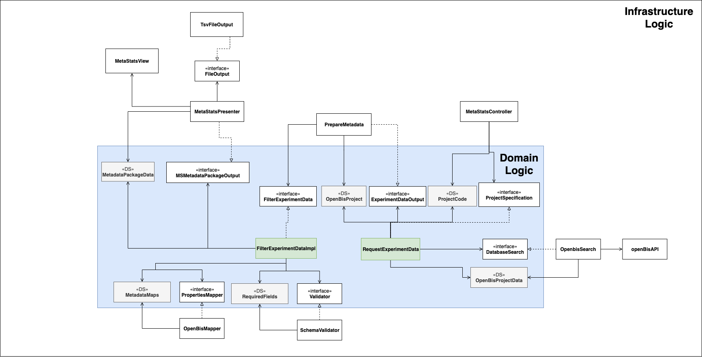

# Developers Guide

This guide is intended to help developers understand the underlying concept of MetaStats.

## Architecture
The architecture of MetaStats is based on Bob Martin's _Clean Architecture_ concepts.

The domain logic controls the business process of the program and provides interfaces which specify the behaviour of external
variable software parts that are located in the infrastructure. Such code needs to be easily exchangeable and thus is
controlled by the interfaces that they need to implement.
Data structures (DS) help to control the exchanged information between the domain and infrastructure layer. Furthermore,
use cases reflects logical steps that are required within the process of generating a metadata description of an openBis project.

### Data Structures (grey)

#### MetaStatsSamples
The usage of external sample objects create dependencies on external libraries within the domain logic. For this reason
the required metadata information about a sample is stored within a self-controlled object named _MetaStatsSamples_.
It has several attributes:

 1. String **type**: indicates what kind of openBis sample it is e.g Q_TEST_SAMPLE. 
 Since metadata is associated with the sample type Q_TEST_SAMPLE, all samples are of this type
 2. String **code**: indicates the sample code stored in openBis
 3. List<String> **relatives**: a list of sample codes that are related to the Q_TEST_SAMPLE in order to accumulate
 the metadata from all sample levels on the Q_TEST_SAMPLE level sample
 4. Map<String,String> **properties**: contains the metadata characteristics of this sample 
 
The mapping file `metastats-infrastructure/src/main/resources/openbisToMetastatsSample.json` indicates 
the stored characteristics with their MetaStats name.

#### MetaStatsExperiments
Similar to the samples experiments also have to be controlled. Some information on the experimental level must be associated
with the sample in order to provide a sufficient description of the samples.

 1. String **type**: indicates what kind of openBis experiment it is e.g Q_PROJECT_DETAILS. 
 3. List<String> **samples**: a list of sample codes that are related to the experiment to associate experiment information
 with the corresponding samples
 4. Map<String,String> **properties**: contains the metadata characteristics of this experiment 
 
The mapping file `metastats-infrastructure/src/main/resources/openbisToMetastatsExperiment.json` indicates 
the stored characteristics with their MetaStats name.

#### MetaStatsPackageEntry
The metadata sheet has several entries in which there is no separation between experiment and sample.
Each entry starts with the ``samplePreparationId`` and all the associated characteristics of related samples or experiments.
The _MetaStatsPackageEntry_ object describes one entry of the final metadata sheet.

 1. String **entryId**: describes the _samplePreparationId_ of the entry to make it easily distinguishable from other entries
 2. HashMap **properties**: all collected characteristics from samples and experiments which are all defined within the json mapping files.

#### Condition
Experiments can be conducted under different conditions e.g. some samples received a special treatment and others not.

There are different types of conditions e.g. treatment, genotype and many more. Beside the kind of condition there is also a 
value associated with the condition type. Therefore, the condition has two attributes.

 1. String **label**: the type of condition e.g genotype
 2. String **value**: the actual condition e.g wildtype or mutant

### Use Cases (green)
The business process is defined by two steps: 1. the data is loaded from the database 2. the data is filtered and transformed
into _MetaStatsPackageEntry_ objects. **PrepareMetadata** controls the flow of data between the use cases.

#### RequestExperimentData
The use case **RequestExperimentData** loads the metadata of the specified openBis project. 
Through the **DatabaseGateway** interface, project data from different databases can be accessed. The accessed data
is stored in _MetaStatsSample_ and _MetaStatsExperiment_ objects. These are transferred with the _ExperimentDataOutput_
interface to the controller **PrepareMetadata**.

#### FilterExperimentDataImpl
The project data is received in form of _MetaStatsSamples_ and _MetaStatsExperiments_ which are now filtered and then 
transformed into _MetaStatsPackageEntries_. These entries are then verified with the json schema specified in
`metastats-application/src/main/resources/model.schema.json`. The schema defines how the characteristics
of the _MetaStatsPackage_ should look like. Further verification like, e.g. check of a samples filenames, are conducted.
Finally, the package is transferred to a _MSMetadataPackageOutput_ implementation which implements a **FileCreator** itself.
_MSMetadataPackeOutput_ specifies the way the output of the package looks like. For example the **TSVFileCreator** defines how an *.tsv output file is created. 

