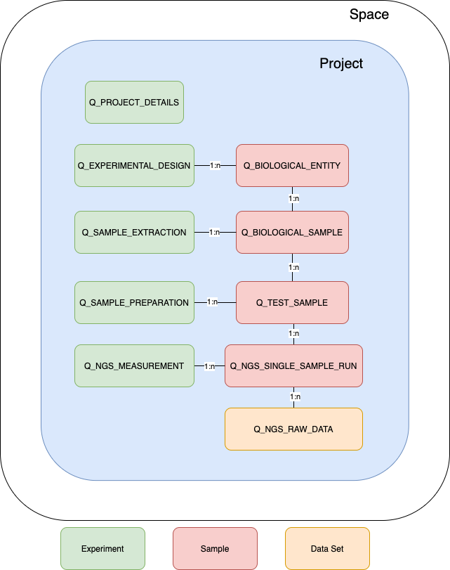

# Project Structure

The project structure of openBis as required from MetaStats is explained in the following diagram. The metadata fields stored
with the respective objects are indicated to give an understanding of how the project should look like.



## Experiment
Samples are grouped into specific experiment types depending on their context.  

### Q_PROJECT_DETAILS
Describes the experiment conditions of the samples with the openBis property.
Relevant openBis fields:
```
Q_EXPERIMENTAL_SETUP
```

### Q_EXPERIMENTAL_DESIGN
Contains the samples of **Q_BIOLOGICAL_ENTITY** and separates the different entities from which samples were taken e.g organisms.

### Q_SAMPLE_EXTRACTION
Contains the samples of **Q_BIOLOGICAL_SAMPLE** and separates the different extraction types e.g different cells.

### Q_SAMPLE_PREPARATION
Separates samples which were prepared separately in a lab. Contains the samples of **Q_TEST_SAMPLE**.

### Q_NGS_MEASUREMENT
This experiment contains samples of one measurement of type **Q_NGS_RAW_DATA**.
Relevant openBis fields:
```
Q_SEQUENCER_DEVICE
```

## SAMPLE
Samples describe the same object on different levels starting from the organims from which the sample was taken and ending 
in the sequence of the taken sample.

### Q_BIOLOGICAL_ENTITY
Describes entity from which the sample is taken.
Relevant openBis fields:
```
CODE
Q_NCBI_ORGANISM
```

### Q_BIOLOGICAL_SAMPLE
Describes from what source the sample was taken.
Relevant openBis fields:
```
CODE
Q_PRIMARY_TISSUE
```

### Q_TEST_SAMPLE
Describes the sample in more detail e.g. the type of sequence,... .
Relevant openBis fields:
```
CODE
Q_EXTERNALDB_ID
Q_SAMPLE_TYPE
Q_RNA_INTEGRITY_NUMBER
Q_SECONDARY_NAME
SEX
```

### Q_NGS_SINGLE_SAMPLE_RUN
Contains all data sets that were generated from this sample. 

## Data Set
All files describing the data of a sample.

### Q_NGS_RAW_DATA
Store the sequencing files of fastq which can be directly accessed from the data set.
